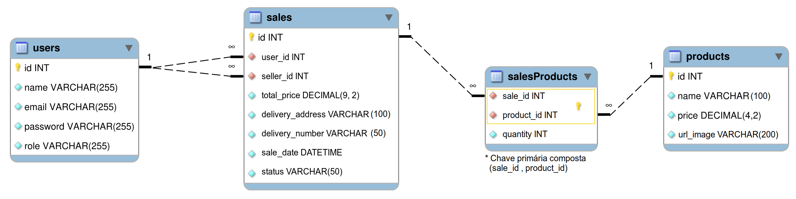

# Delivery APP API
Delivery APP é uma aplicação RESTful para a manipulação e leitura de compras, permitindo operações de CRUD e autenticação via JWT.

## Visão geral

### O desafio

O Delivery APP foi pensado para a prática geral dos conhecimentos sobre uma aplicação em Node.js com Express, cobrindo tópicos como: SOLID, REST, TDD e POO.

__Os usuários devem ser capaz de?__
- Registrar-se e Autenticar-se
- Criar compras
- Buscar compras
- Atualizar status das compras
- Consumir a API de qualquer plataforma via HTTP

### Imagens

<small>Esquema do banco de dados</small>

<small>Documentação da API</small>

### Links

- URL da documentação: [Link]

## Meu processo

### Construído com

- JavaScript
- Node.js
- Express.js
- Sequelize
- Postgres
- Mocha, Chai and Sinon
- Swagger

### O que aprendi

Em um primeiro momento pude praticar o TDD como método de desenvolvimento, consolidar meu conhecimento sobre construção de APIs com Node.js e Express e ainda aprender duas novas ferramentas, o Swagger e o Prisma.

Também utilizei esse projeto para praticar e entender os princípios SOLID, o refatorando e deixando seu código mais limpo, organizado e legível.

### Recursos úteis

- [Artigos pessoais sobre Express](https://dev.to/gabrielhsilvestre/series/17270)
- [Artigos pessoais sobre SOLID e POO](https://dev.to/gabrielhsilvestre/series/18165)
- [Documentação do Sequelize](https://sequelize.org/)

## Autores

### Hiago Briano
Linkedin - https://www.linkedin.com/in/hiago-briano/

Email - hiago.artist@hotmail.com

### Gabriel Silvestre
Linkedin - https://www.linkedin.com/in/gabrielh-silvestre/

Email - gabriel.h.silvestre11@gmail.com

### Elton Moreno
Linkedin - https://www.linkedin.com/in/eltonmoreno/

Email - eltonmorenocl@gmail.com

### Daniel Tavares
Linkedin - https://www.linkedin.com/in/daniel-tavares-819727217/

Email - daniel1tavares@outlook.com

### André Luiz S. da Silva
Linkedin - https://www.linkedin.com/in/andreluiiz/

Email - andreluizgyn1@gmail.com

