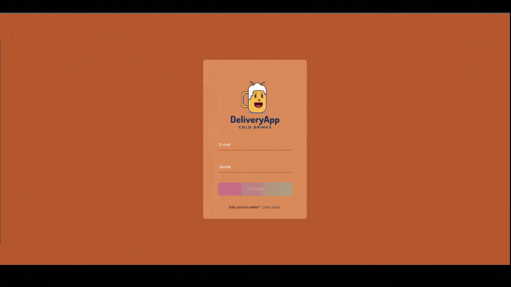
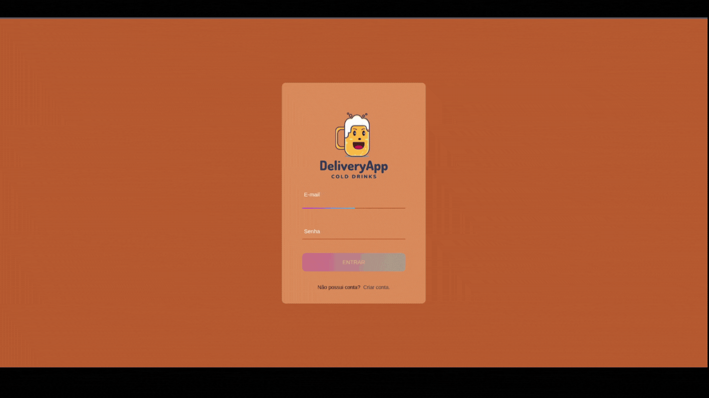
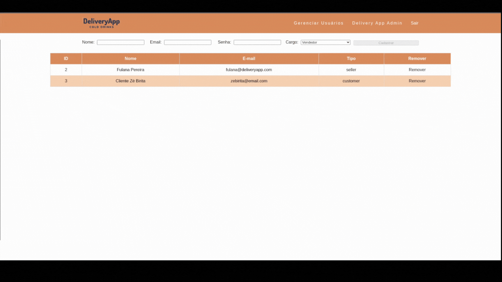

# To-do List API

## Visão geral

### O desafio

Criar um site capaz de gerenciar o [banco de dados](../back-end/), incluindo fazer login, cadastro de clientes, administrar vendas e usuarios registrados.

## Telas dos clientes:

  

    <strong>Tela 1 - Login</strong>
  
 
  
- Autenticar-se;
- Cadastrar novo úsuario.

  

    <strong>Tela 2 - Produtos</strong>
  
 

- Adicionar produtos ao carrinho;
- Remover produtos do carrinho;
- Ver o valor total do carrinho enquanto faz as compras.

  

    <strong>Tela 3 - Carrinho</strong>
  
 

- Remover produtos do carrinho;
- Ver o valor total do carrinho;
- Selecionar vendedor;
- Finalizar a compra.

  

    <strong>Tela 4 - Detalhes do pedidos</strong>
  
 

- É possivél ver:
  - Número do pedido;
  - Vendedor responsavél;
  - Data de compra;
  - Status do pedido;
  - Lista dos pedidos com a quantidade comprada;
  - Valor da compra.
- Marcar pedido como entregue quando estiver com o status `Em Transito`.

  

    <strong>Tela 5 - Meus pedidos</strong>
  
 

- É possivél ver todos os pedidos e as informações:
  - Número do pedido;
  - Status do pedido;
  - Data de compra;
  - Valor da compra.
- Clicar no pedido para ter mais detalhes da compra.

## Telas dos vendedores:

  

    <strong>Tela 1 - Login</strong>
  
 
  
- Autenticar-se;

  

    <strong>Tela 2 - Meus pedidos</strong>
  
 

- É possivél ver todos os pedidos e as informações:
  - Número do pedido;
  - Status do pedido;
  - Data de compra;
  - Valor da compra;
  - Endereço.
- Clicar no pedido para ter mais detalhes da compra.

  

    <strong>Tela 3 - Detalhes do pedidos</strong>
  
 

- É possivél ver:
  - Número do pedido;
  - Data de compra;
  - Status do pedido;
  - Lista dos pedidos com a quantidade comprada;
  - Valor da compra.
- Mudar status para `Preparando` e / ou `Em Trânsito`

  

    <strong>Veja Funcionando</strong>
  
 
  
> Faça Login com
  - Usuario: fulana@deliveryapp.com
  - Senha: fulana@123

## Telas dos administradores:

  

    <strong>Tela 1 - Login</strong>
  
 
  
- Autenticar-se.

  

    <strong>Tela 2 - Administrador</strong>
  
 
  
- Ver usuários e vendedores cadastrados;
- Criar usuários e vendedores;
- Remover usuários e vendedores.

  

    <strong>Veja Funcionando</strong>
  
 
  
> Faça Login com
  - Usuario: adm@deliveryapp.com
  - Senha: --adm2@21!!--

## Construído com

- JavaScript
- React.js
- Axios

## Veja a aplicação rodando

`Acesse:` [Link]

#### Primeiro acesso?
> É importante saber que para fazer o cadastro é preciso colocar um e-mail em um formato valido e uma senha de pelo menos 6 caracteres.

## Recursos úteis

- [Documentação do Axios](https://axios-http.com/ptbr/)

## Autores

### Hiago Briano
Linkedin - https://www.linkedin.com/in/hiago-briano/

Email - hiago.artist@hotmail.com

### Gabriel Silvestre
Linkedin - https://www.linkedin.com/in/gabrielh-silvestre/

Email - gabriel.h.silvestre11@gmail.com

### Elton Moreno
Linkedin - https://www.linkedin.com/in/eltonmoreno/

Email - eltonmorenocl@gmail.com

### Daniel Tavares
Linkedin - https://www.linkedin.com/in/daniel-tavares-819727217/

Email - daniel1tavares@outlook.com

### André Luiz S. da Silva
Linkedin - https://www.linkedin.com/in/andreluiiz/

Email - andreluizgyn1@gmail.com